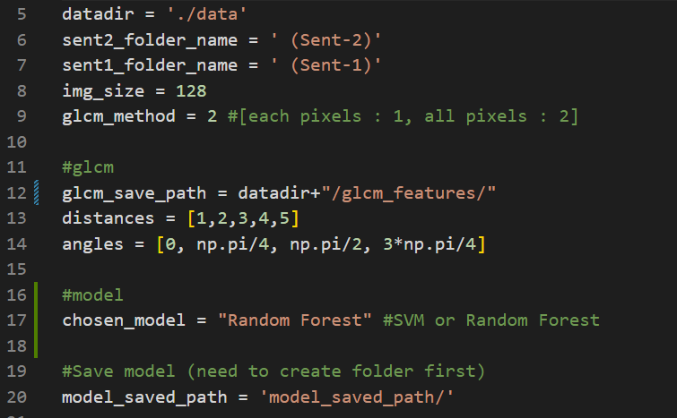

# Land-cover-GLCM

This project is for land cover segmentation using GLCM as feature extraction

## Pre-Instructions

```powershell
pip install requirements.txt
```

## Instruction
1. Go to config folder
2. Go to config.py

3. Edit the code based on your needs
4. run this code below
```powershell
python .\main.py 
```